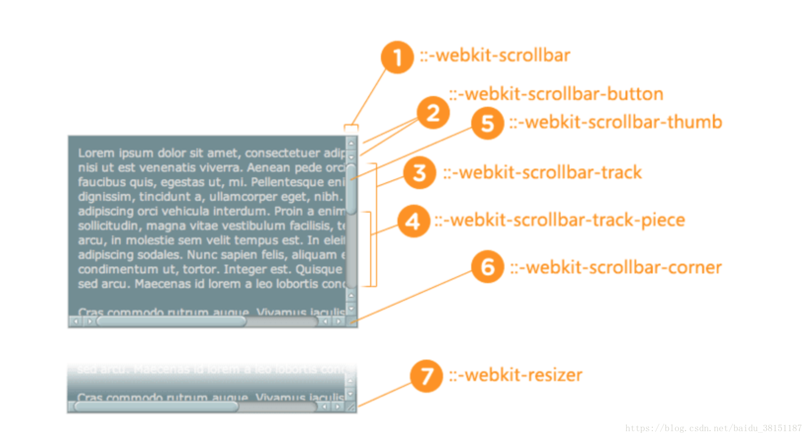
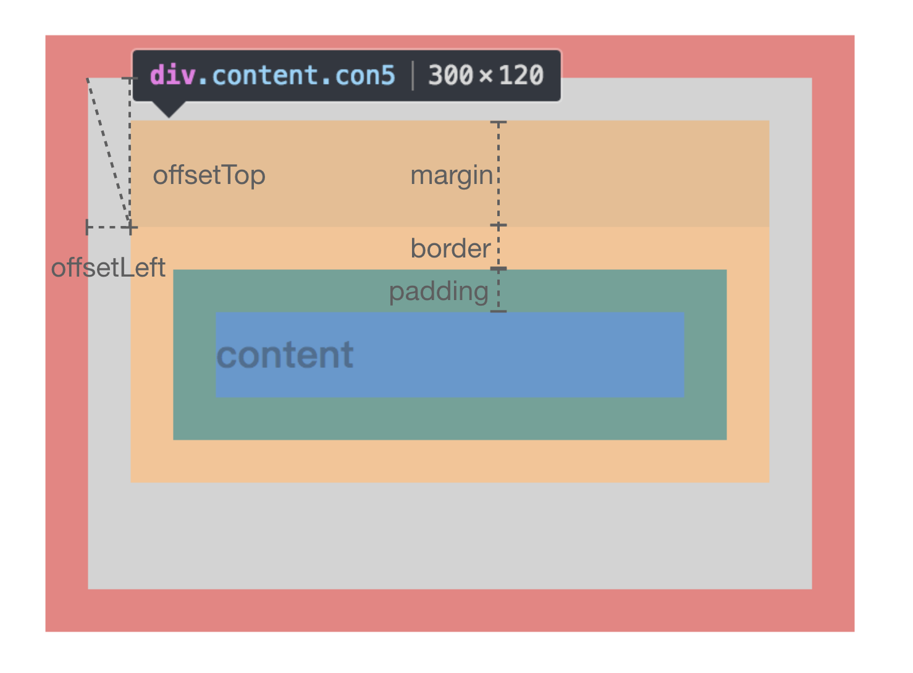

  平时开发时候遇到计算DOM元素位置的时候，offsetHeight、clientHeight、scrollHeight经常混淆每次都要查MDN，这次索性把这几个属性统一整理一下。
  
## offsetHeight & offsetWidth
### 说明
> `HTMLElement.offsetHeight`
- 只读
- 返回元素的布局高度(layout height)
- 值 = contentH + paddingH + borderH
- display:none时，值为0
- 不包含伪类(::before ::after)的高度
- 值的数据类型为数字

### 图示


## clientHeight & clientWidth
### 说明
> `Element.clientHeight`
- 只读
- 返回元素的内部高度
- 一个元素没有css或者这个元素是内联元素时，返回 **0**
- 值 = contentH + paddingH - scrollbarH (if present)

### 图示



## scrollHeight & scrollWidth
### 说明
- 只读
- 返回元素的高度，包括不可见的溢出部分
- 包含伪类的高度(::after,::before等)
- 如果没有滚动条的话，和clientHeight相等

### 图示


### 判断是否滚到最底部
```javascript
 const isRead = HTMLElement.scrollHeight - HTMLElement.scrollTop === HTMLElement.clientHeight;
```

## offsetParent & offsetLeft & offsetTop
### offsetParent
> HTMLElement.offsetParent
- 只读
- 返回最近的设置过position的祖先元素
- 如果当前元素没有设置过position，会返回最近的td、th、table、body
- 当该元素的display为none时候，offsetParent 返回 null

### offsetLeft & offsetTop
- 只读
- 对于块状元素，offsetLeft 和 offsetTop 描述的是当前元素的border外侧 距offsetParent的border内侧的距离，和scroll无关
- 对于内联元素，offsetLeft 和 offsetTop 描述的是当前元素的border外侧 距offsetParent的border外侧的距离，和scroll无关


### 图示



 